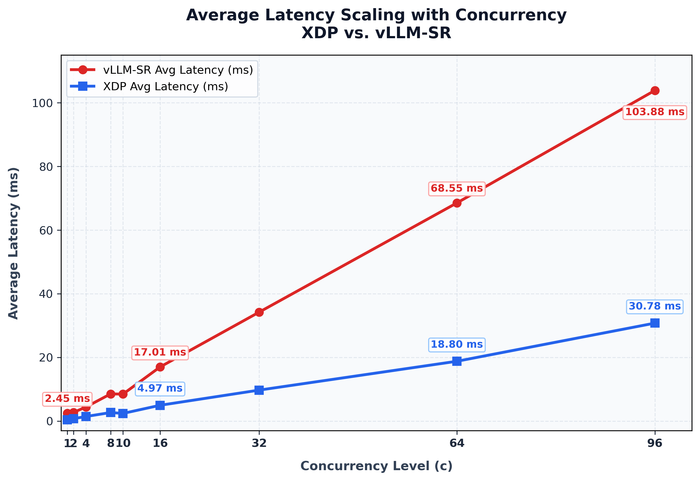

# XDP vs. vllm-sr Benchmark Summary

This markdown summarizes the load testing results comparing `xsr` against `vllm-sr` across varying concurrency levels (1, 2, 4, 8, 10, 16, 32, 64, 96).
Both XDP and vllm-sr execute the shared literal keyword policy, matching 13 case-insensitive substring matching across 13 domain keywords to route prompts into `coding`, `math`, and `others` routes.

---

## Summary

| Concurrency (c) | Threads (t) | XDP RPS           | XDP Avg Latency | vLLM-SR RPS   | vLLM-SR Avg Latency | XDP Throughput Speedup  | XDP Latency Speedup |
| :---:             | :---:         | :---:             | :---:           | :---:         | :---:               | :---:                   | :---:               |
| 1                 | 1             | 7,290.39          | 0.13 ms         | 411.35        | 2.40 ms             | 17.7×                   | 19.1×               |
| 2                 | 2             | 12,679.96         | 0.14 ms         | 719.87        | 2.74 ms             | 17.6×                   | 19.8×               |
| 4                 | 4             | 17,783.60         | 0.20 ms         | 910.55        | 4.35 ms             | 19.5×                   | 21.7×               |
| 8                 | 4             | 21,961.98         | 0.33 ms         | 939.93        | 8.47 ms             | 23.4×                   | 25.9×               |
| 10                | 4             | 21,591.17         | 0.33 ms         | 929.78        | 8.55 ms             | 23.2×                   | 25.8×               |
| 16                | 4             | 25,693.47         | 0.60 ms         | 927.17        | 17.21 ms            | 27.7×                   | 28.5×               |
| 32                | 4             | 25,555.63         | 1.21 ms         | 927.75        | 34.41 ms            | 27.5×                   | 28.4×               |
| 64                | 4             | 25,129.42         | 2.50 ms         | 914.97        | 69.65 ms            | 27.5×                   | 27.9×               |
| 96                | 4             | 25,040.14         | 3.76 ms         | 917.54        | 103.89 ms           | 27.3×                   | 27.6×               |

---

## Detailed Benchmark Results

### Concurrency 1 (c=1, t=1)
* **XDP Throughput**: `7,290.39 RPS` | **Avg Latency**: `125.47 us`
* **vLLM-SR Throughput**: `411.35 RPS` | **Avg Latency**: `2.40 ms`
* **Speedup**: `17.7×` Throughput | `19.1×` Latency

```text
--- [1/2] XDP Route ---
  1 threads and 1 connections
  Thread Stats   Avg      Stdev     Max   +/- Stdev
    Latency   125.47us  130.50us   3.70ms   99.38%
    Req/Sec     7.32k   273.47     7.84k    66.00%
  72914 requests in 10.00s, 9.53MB read
Requests/sec:   7290.39

--- [2/2] vLLM-SR Route ---
  1 threads and 1 connections
  Thread Stats   Avg      Stdev     Max   +/- Stdev
    Latency     2.40ms  792.66us   6.84ms   66.85%
    Req/Sec   413.03     37.42   505.00     64.00%
  4115 requests in 10.00s, 1.51MB read
Requests/sec:    411.35
```

---

### Concurrency 2 (c=2, t=2)
* **XDP Throughput**: `12,679.96 RPS` | **Avg Latency**: `138.63 us`
* **vLLM-SR Throughput**: `719.87 RPS` | **Avg Latency**: `2.74 ms`
* **Speedup**: `17.6×` Throughput | `19.8×` Latency

```text
--- [1/2] XDP Route ---
  2 threads and 2 connections
  Thread Stats   Avg      Stdev     Max   +/- Stdev
    Latency   138.63us   74.50us   3.34ms   96.55%
    Req/Sec     6.37k   190.86     6.77k    67.33%
  128060 requests in 10.10s, 16.74MB read
Requests/sec:  12679.96

--- [2/2] vLLM-SR Route ---
  2 threads and 2 connections
  Thread Stats   Avg      Stdev     Max   +/- Stdev
    Latency     2.74ms    0.88ms   7.54ms   67.82%
    Req/Sec   361.45     31.55   440.00     69.50%
  7202 requests in 10.00s, 2.63MB read
Requests/sec:    719.87
```

---

### Concurrency 4 (c=4, t=4)
* **XDP Throughput**: `17,783.60 RPS` | **Avg Latency**: `200.71 us`
* **vLLM-SR Throughput**: `910.55 RPS` | **Avg Latency**: `4.35 ms`
* **Speedup**: `19.5×` Throughput | `21.7×` Latency

```text
--- [1/2] XDP Route ---
  4 threads and 4 connections
  Thread Stats   Avg      Stdev     Max   +/- Stdev
    Latency   200.71us   97.62us   3.97ms   95.35%
    Req/Sec     4.47k   141.75     4.85k    71.04%
  179609 requests in 10.10s, 23.46MB read
Requests/sec:  17783.60

--- [2/2] vLLM-SR Route ---
  4 threads and 4 connections
  Thread Stats   Avg      Stdev     Max   +/- Stdev
    Latency     4.35ms    1.44ms  12.23ms   67.20%
    Req/Sec   228.65     31.07   313.00     63.50%
  9113 requests in 10.01s, 3.35MB read
Requests/sec:    910.55
```

---

### Concurrency 8 (c=8, t=4)
* **XDP Throughput**: `21,961.98 RPS` | **Avg Latency**: `326.59 us`
* **vLLM-SR Throughput**: `939.93 RPS` | **Avg Latency**: `8.47 ms`
* **Speedup**: `23.4×` Throughput | `25.9×` Latency

```text
--- [1/2] XDP Route ---
  4 threads and 8 connections
  Thread Stats   Avg      Stdev     Max   +/- Stdev
    Latency   326.59us  164.93us   5.15ms   84.53%
    Req/Sec     5.54k   390.56    10.08k    90.80%
  221798 requests in 10.10s, 28.98MB read
Requests/sec:  21961.98

--- [2/2] vLLM-SR Route ---
  4 threads and 8 connections
  Thread Stats   Avg      Stdev     Max   +/- Stdev
    Latency     8.47ms    2.28ms  22.69ms   69.70%
    Req/Sec   235.98     35.65   320.00     65.50%
  9407 requests in 10.01s, 3.45MB read
Requests/sec:    939.93
```

---

### Concurrency 10 (c=10, t=4)
* **XDP Throughput**: `21,591.17 RPS` | **Avg Latency**: `331.04 us`
* **vLLM-SR Throughput**: `929.78 RPS` | **Avg Latency**: `8.55 ms`
* **Speedup**: `23.2×` Throughput | `25.8×` Latency

```text
--- [1/2] XDP Route ---
  4 threads and 10 connections
  Thread Stats   Avg      Stdev     Max   +/- Stdev
    Latency   331.04us  147.89us   4.77ms   82.11%
    Req/Sec     5.43k   255.48     6.16k    72.28%
  218066 requests in 10.10s, 28.49MB read
Requests/sec:  21591.17

--- [2/2] vLLM-SR Route ---
  4 threads and 10 connections
  Thread Stats   Avg      Stdev     Max   +/- Stdev
    Latency     8.55ms    2.47ms  23.38ms   69.65%
    Req/Sec   233.52     35.94   313.00     65.25%
  9308 requests in 10.01s, 3.42MB read
Requests/sec:    929.78
```

---

### Concurrency 16 (c=16, t=4)
* **XDP Throughput**: `25,693.47 RPS` | **Avg Latency**: `603.96 us`
* **vLLM-SR Throughput**: `927.17 RPS` | **Avg Latency**: `17.21 ms`
* **Speedup**: `27.7×` Throughput | `28.5×` Latency

```text
--- [1/2] XDP Route ---
  4 threads and 16 connections
  Thread Stats   Avg      Stdev     Max   +/- Stdev
    Latency   603.96us  393.40us  11.22ms   98.13%
    Req/Sec     6.50k   540.45    15.61k    92.77%
  259485 requests in 10.10s, 33.91MB read
Requests/sec:  25693.47

--- [2/2] vLLM-SR Route ---
  4 threads and 16 connections
  Thread Stats   Avg      Stdev     Max   +/- Stdev
    Latency    17.21ms    4.11ms  62.55ms   75.05%
    Req/Sec   232.76     35.77   310.00     62.50%
  9278 requests in 10.01s, 3.41MB read
Requests/sec:    927.17
```

---

### Concurrency 32 (c=32, t=4)
* **XDP Throughput**: `25,555.63 RPS` | **Avg Latency**: `1.21 ms`
* **vLLM-SR Throughput**: `927.75 RPS` | **Avg Latency**: `34.41 ms`
* **Speedup**: `27.5×` Throughput | `28.4×` Latency

```text
--- [1/2] XDP Route ---
  4 threads and 32 connections
  Thread Stats   Avg      Stdev     Max   +/- Stdev
    Latency     1.21ms  370.13us  13.63ms   96.39%
    Req/Sec     6.47k   553.49    16.53k    96.01%
  258106 requests in 10.10s, 33.73MB read
Requests/sec:  25555.63

--- [2/2] vLLM-SR Route ---
  4 threads and 32 connections
  Thread Stats   Avg      Stdev     Max   +/- Stdev
    Latency    34.41ms    7.46ms 117.40ms   82.02%
    Req/Sec   232.90     33.93   320.00     67.75%
  9282 requests in 10.00s, 3.41MB read
Requests/sec:    927.75
```

---

### Concurrency 64 (c=64, t=4)
* **XDP Throughput**: `25,129.42 RPS` | **Avg Latency**: `2.50 ms`
* **vLLM-SR Throughput**: `914.97 RPS` | **Avg Latency**: `69.65 ms`
* **Speedup**: `27.5×` Throughput | `27.9×` Latency

```text
--- [1/2] XDP Route ---
  4 threads and 64 connections
  Thread Stats   Avg      Stdev     Max   +/- Stdev
    Latency     2.50ms  516.84us  14.97ms   92.09%
    Req/Sec     6.34k   520.93    12.59k    93.78%
  253790 requests in 10.10s, 33.17MB read
Requests/sec:  25129.42

--- [2/2] vLLM-SR Route ---
  4 threads and 64 connections
  Thread Stats   Avg      Stdev     Max   +/- Stdev
    Latency    69.65ms   15.15ms 223.14ms   83.09%
    Req/Sec   229.90     44.58   333.00     63.00%
  9163 requests in 10.01s, 3.37MB read
Requests/sec:    914.97
```

---

### Concurrency 96 (c=96, t=4)
* **XDP Throughput**: `25,040.14 RPS` | **Avg Latency**: `3.76 ms`
* **vLLM-SR Throughput**: `917.54 RPS` | **Avg Latency**: `103.89 ms`
* **Speedup**: `27.3×` Throughput | `27.6×` Latency

```text
--- [1/2] XDP Route ---
  4 threads and 96 connections
  Thread Stats   Avg      Stdev     Max   +/- Stdev
    Latency     3.76ms  490.24us   9.95ms   81.88%
    Req/Sec     6.34k   730.41    19.07k    94.76%
  252889 requests in 10.10s, 33.05MB read
Requests/sec:  25040.14

--- [2/2] vLLM-SR Route ---
  4 threads and 96 connections
  Thread Stats   Avg      Stdev     Max   +/- Stdev
    Latency   103.89ms   21.09ms 250.65ms   87.93%
    Req/Sec   230.79     39.99   363.00     72.00%
  9199 requests in 10.03s, 3.38MB read
Requests/sec:    917.54
```

---

## Observations: Advantages of XDP

1. **Throughput Scaling**: XDP scales up to **~25,000 – 25,700 RPS** across higher concurrency levels ($c \ge 16$), whereas vllm-sr caps around **~915 – 940 RPS**.
2. **Sub-millisecond Latency**: XDP delivers sub-millisecond average latency at concurrency $\le 16$ ($125\mu\text{s}$ at $c=1$ to $604\mu\text{s}$ at $c=16$) and stays low ($2.50\text{ms}$ at $c=64$, $3.76\text{ms}$ at $c=96$), whereas vllm-sr average latency grows linearly up to **103.89ms**.
3. **Efficiency**: XDP achieves an overall **~17.6× to 27.7× throughput speedup** and **~19.1× to 28.5× latency speedup** compared to application-layer HTTP semantic routing.

<!-- image of latency_comparison -->
